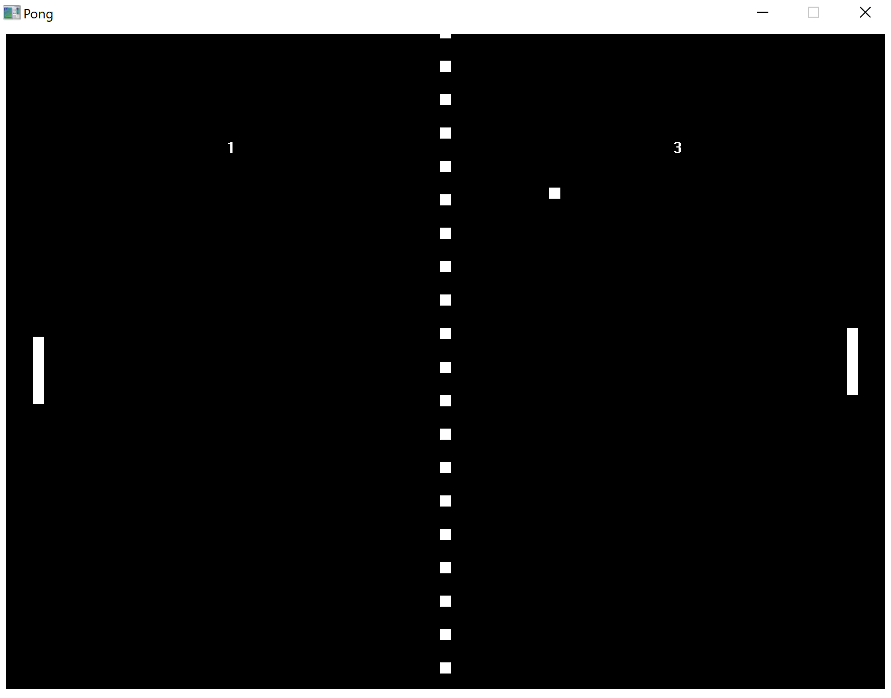

# Description

A Pong replica built from the ground up in x86 Assembly. Features direct Win32 API integration for graphics and input handling, stripping away high-level abstractions to achieve maximum execution efficiency.

# Screenshots

